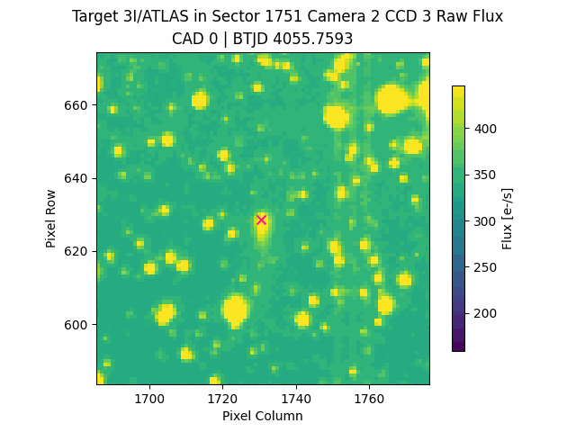
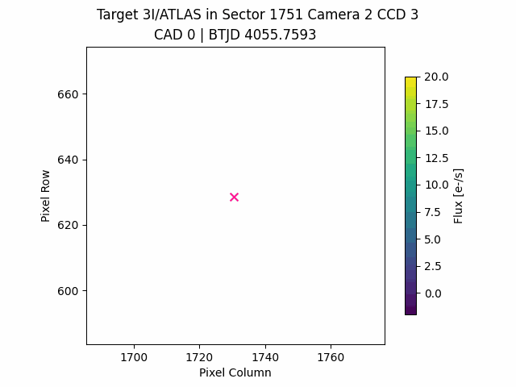
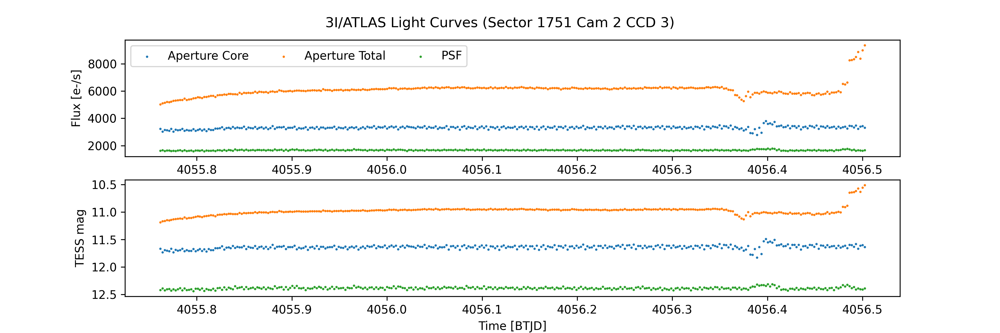
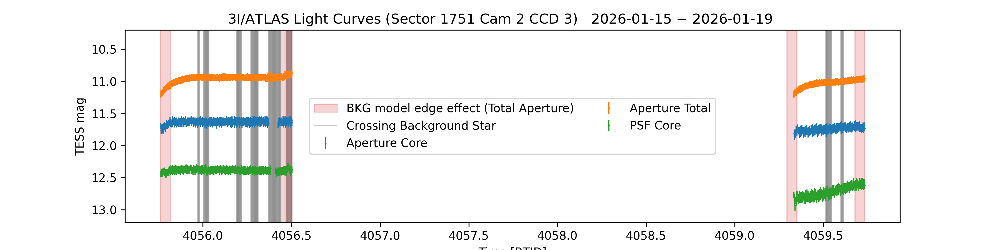

# TESS - 3I/ATLAS 

This repository contains information on the data reduction and analysis for the High Level Science Products (HLSP) created by the TESS Science Support Center for the observations of 3I/ATLAS performed in 2026. If you use these in your work, please cite Martinez-Palomera et al. (2026, to be submitted) (Research note describing the creation of these in detail) and the [Zenodo data repository](https://doi.org/10.5281/zenodo.18344942). This work is based off the data analysis and reduction in [Martinez-Palomera et al. (2025)](https://ui.adsabs.harvard.edu/abs/2025ApJ...994L..51M/abstract).

## January 2026 Data

This contains the data reduction performed on the data taken during TESS observations of 3I/ATLAS during sector 1751 between January 16th and 22nd, 2026. 
For further details on TESS sector 1751 observations visit the [TSSC website](https://heasarc.gsfc.nasa.gov/docs/tess/tess-special-news-bulletin-dec-18th.html).

> **As January 23, 2026, only 322 full frame images have been processed by the SPOC pipeline, which correspond to observations between 2026-01-15T06:04:18 and 2026-01-15T23:54:18 UTC.**

The data created here is available in a [Zenodo repository](https://doi.org/10.5281/zenodo.18344942) and it will be updated with new data as soon this is available at the MAST archive. 
We will update these repositories with new data products, figures, and details as more data becomes available at the MAST archive.

Here, you'll find dedicated notebooks to:
* Create object-centered moving TPF from TESS sector 1751 using [tess-asteroids](https://altuson.github.io/tess-asteroids/), which models the scattered background light and star field and extract lightcurves using aperture and PSF photometry. 
  * Using the SPOC full-frame images [here](notebooks/2026/make_mTPF_from_ffi.ipynb).
* Open the data products published in this [Zenodo](https://doi.org/10.5281/zenodo.18344942) repository, [here](notebooks/2026/open_hlsp_data.ipynb).

These are animations of the TESS observations of 3I/ATLAS with the raw (left) and corrected (right) images. The corrected images are background (scattered light and stars) subtracted. The bright pixels in the field are residuals from the background subtraction, primarily from very bright stars.

    
    

Below are the light curves extracted from the data. We defined two aperture masks, one for the core (blue) and another for the core plus tail (orange). Additionally we computed PSF photometry which only accounts for the comet nucleus (green).
The noisier photometric points near BTJD 4056.4 are due to a bright saturated star. The increase in brightness in the total flux (orange) is due to edge effect in the background star model which affected the tail of the comet. 

    

Below is a clean version of the light curve after removing cadences with high background model noise due to the saturated star. We also highlighted times when the comet passed over background stars and the frames with the edge effect.

    

If you have questions regarding data processing, access, content, and suggestions on how to improve them in future versions, contact us through the [TSSC helpdesk](https://heasarc.gsfc.nasa.gov/docs/tess/helpdesk.html), GitHub issues in this repository, or via email.

#### Credits
Development done by [Jorge Martinez-Palomera](https://github.com/jorgemarpa) with the support of the [TESS Science Support Center](https://heasarc.gsfc.nasa.gov/docs/tess/). Based on the `tess-asteroids` package developed by [Amy Tuson](https://github.com/altuson).

---
Funding for this work is provided by NASA grants to the TESS Science Support Center.