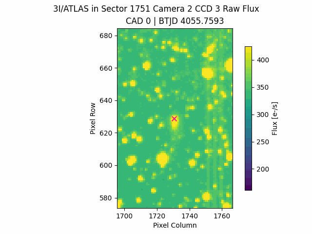
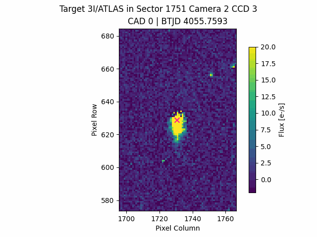
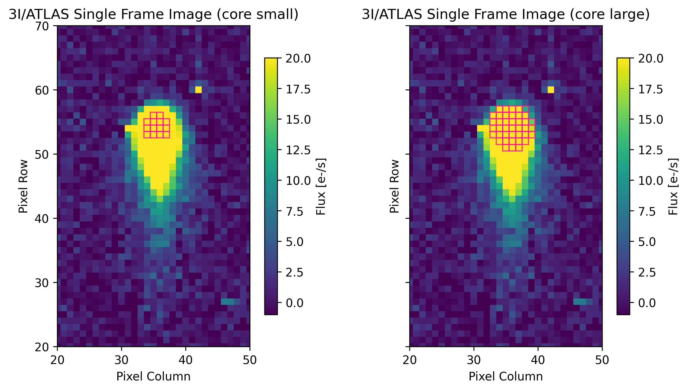
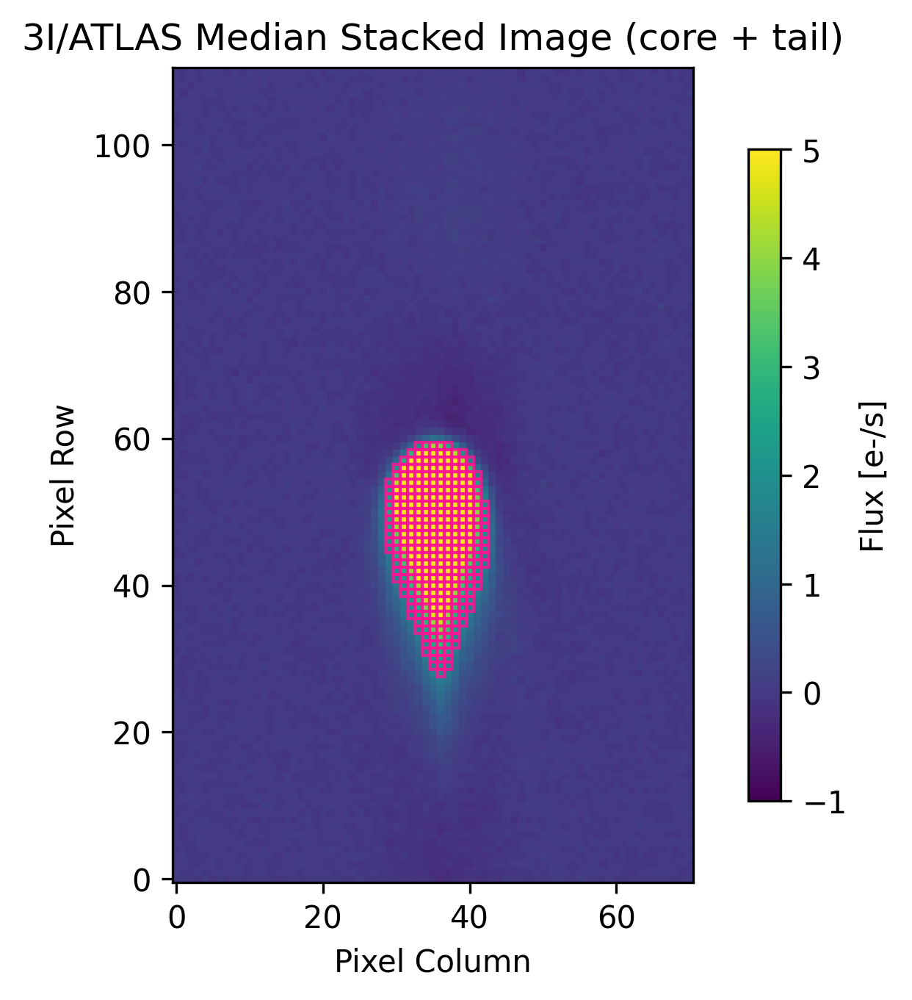
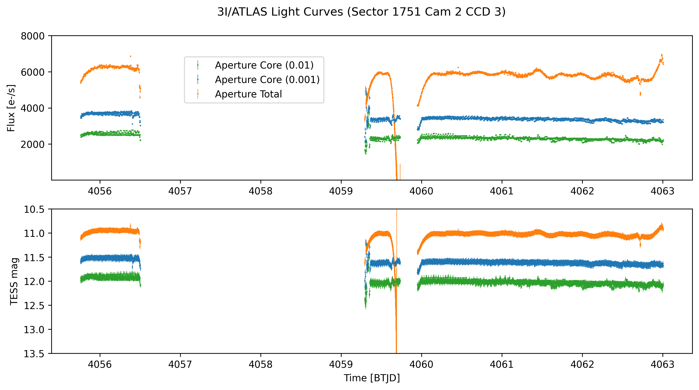
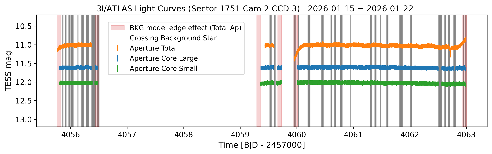

# TESS - 3I/ATLAS 
---

This repository contains information on the data reduction and analysis for the High Level Science Products (HLSP) created by the TESS Science Support Center (TSSC) for the observations of 3I/ATLAS performed in 2026. If you use these in your work, please cite [Martinez-Palomera et al. (2026)](https://ui.adsabs.harvard.edu/abs/2026RNAAS..10...28M/abstract) (Research Note describing the creation of these in detail) and the [Zenodo data repository](https://zenodo.org/records/19376249). This data set will also be available soon at [MAST](https://archive.stsci.edu/contents/newsletters/january-2026/tess-3i-atlas). This work is based off the data analysis and reduction in [Martinez-Palomera et al. (2025)](https://ui.adsabs.harvard.edu/abs/2025ApJ...994L..51M/abstract).

---

## January 2026 Data

TESS observed a field contained 3I/ATLAS (Sector 1751) between January 16th and 22nd, 2026.. 
For further details on TESS sector 1751 observations visit the [TSSC website](https://heasarc.gsfc.nasa.gov/docs/tess/tess-special-news-bulletin-dec-18th.html).

> **All 1835 full frame images processed by the SPOC pipeline have been archived, corresponding to observations between 2026-01-15 06:04:18 and 2026-01-22 11:58:47 UTC.**
> 
> **A total of 3044 frames from the Target Pixel Files (TPF) 20s candence data processed by the SPOC pipeline have been archived, corresponding to observations between 2026-01-15 06:04:18 and 2026-01-22 11:58:47 UTC.**

The data created here are available in a [Zenodo repository](https://zenodo.org/records/19376249) that will be updated with new data as soon as newly processed full frame images are available at the MAST archive. 
We will also update this repository with new data products, figures, and details as more data becomes available at the MAST archive.

Here, you'll find dedicated notebooks to:
* Create object-centered moving TPF from TESS sector 1751 using [tess-asteroids](https://altuson.github.io/tess-asteroids/), which models the scattered background light and star field and extracts lightcurves using aperture photometry. 
  * Using the SPOC full-frame images [here](notebooks/2026/make_mTPF_from_ffi.ipynb) ([interactive view](https://nbviewer.org/github/tessgi/tess-3i/blob/v2.0/notebooks/2026/make_mTPF_from_ffi.ipynb)).
  * Using the SPOC 20s TPF data [here](notebooks/2026/make_mTPF_from_tpf.ipynb).
* Open the data products published in this [Zenodo](https://zenodo.org/records/19376249) repository, [here](notebooks/2026/open_hlsp_data.ipynb).

Below are animations of the TESS observations of 3I/ATLAS with the raw (left) and corrected (right) images. The corrected images are background (scattered light and stars) subtracted. The bright pixels in the field are residuals from the background subtraction, primarily from very bright stars.

    
    

We defined three aperture mask to compute our light curves. The next figures show the core small, core large and total (core + tail) apertures.

    
    

Below are the light curves extracted from the data. We defined three aperture masks, a small one for the core (green), a large core aperture (blue), and a total aperture (orange) which includes core and tail.
The noisier photometric points near BTJD 4056.4 are due to a bright saturated star. The ramped change in brightness in the total flux (orange) at the beginning and end of each segment are due to edge effect in the background star model which affected the tail of the comet. 

    

Below is a clean version of the light curve after removing cadences with high background model noise due to the saturated star and correcting the jitter motion using a [linear regression corrector](https://lightkurve.github.io/lightkurve/tutorials/2-creating-light-curves/2-3-removing-scattered-light-using-regressioncorrector.html). We also highlighted times when the comet passed over background stars. 

    

If you have questions regarding data processing, access, content, and suggestions on how to improve them in future versions, contact us through the [TSSC helpdesk](https://heasarc.gsfc.nasa.gov/docs/tess/helpdesk.html), GitHub issues in this repository, or via email.

---

## Change Log

### v2.1 [03/01/2026]

* Adding 20s TPF data, image cutout is (H,W) = (93, 35), the width axis is the maximum allowed from the 50x50 TPF data in order to get a uniform cutout. There are 3,044 frames in the data cubes and time series.
* Adding diagnostic plots for the 20s data
* New demo notebook with 20s data extraction and correction.

### v2.0
* We increase the size of the image cutout to (H,W) = (111, 71) pixels to include more pixels in the axis comet's tail direction. 
* We remove the PSF photometry light curve from our data products due to subpar quality. For details see the discussion at the end of the data analysis notebook [here](/notebooks/2026/make_mTPF_from_ffi.ipynb).
* Added detrended version of the light curves computed with a linear regression model.

### v1.2
* Added the second part of the data from BTJD 4060 to 4063.

### v1.1
* Added the remaining data from the first part of the sector between BTJD 4059 to 4060

---

## Credits
Development done by [Jorge Martinez-Palomera](https://github.com/jorgemarpa) with the support of the [TESS Science Support Center](https://heasarc.gsfc.nasa.gov/docs/tess/). Based on the `tess-asteroids` package developed by [Amy Tuson](https://github.com/altuson).

